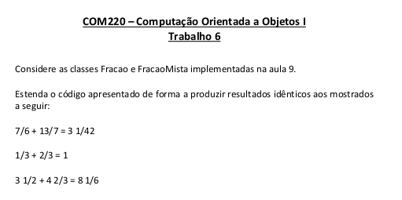
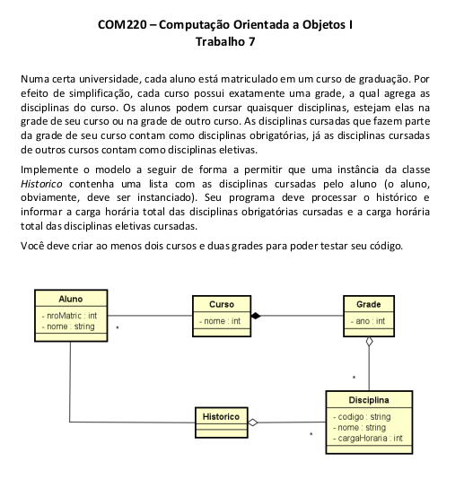

Exercícios do Curso de Programação Orientada a objetos

[Trabalho 6](https://github.com/LuanBMartins/Object-oriented-programming/tree/master/Trabalho-6) 

[Trabalho 7](https://github.com/LuanBMartins/Object-oriented-programming/tree/master/Trabalho-7)

